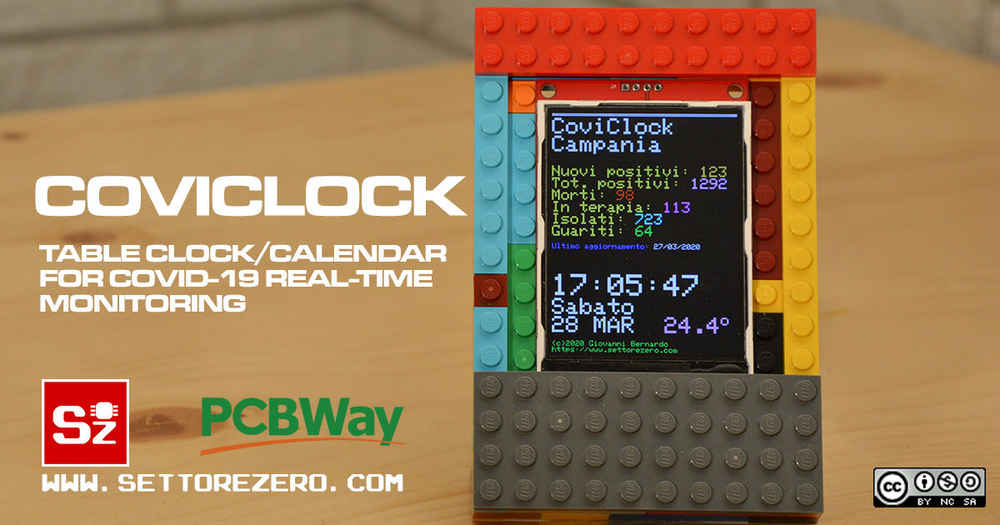

  

# Coviclock

This is a NodeMCU device that shows data about Covid-19 in Italy taken from a remote CSV updated by _Presidenza del Consiglio dei ministri - Dipartimento della Protezione Civile_ (Github user: PCM-DPC). PCM-DPC offers open data uploaded on Github [on this url](https://github.com/pcm-dpc/COVID-19) under the CC BY-4.0 License.
  
This project reads the last CSV, uploaded for Italian Regions, and extract the last data for a particular Region, then explodes the row and shows data on an ILI9341 display. Time/date is showed by updating once a day the time using a NTP Server. Time is keeped even if the NTP server is not available: in this case software will retry to connect to NTP server after some minutes. New CSV data are downloaded once a day after 18:00, if new data are not present, software retries after 10 minutes.

[Click here for more info on this project](https://www.settorezero.com/wordpress/en/coviclock-informazioni-tempo-reale-coronavirus-covid19/)  

### Settings
Change `ssid` and `password` variables of the code to suit your router. Change aventually the `gateway` IP Address if your router uses a different IP address than 192.168.1.1. Change `csvFind` for extracting data about your your region: you must write the region in the same manner [was written in the CSV](https://github.com/pcm-dpc/COVID-19/blob/master/dati-regioni/dpc-covid19-ita-regioni-latest.csv).  

If you're interested: Protezione civile uploads Data also in [JSON format](https://github.com/pcm-dpc/COVID-19/blob/master/dati-json/dpc-covid19-ita-regioni-latest.json). My code don't use this possibility.

### PCBs by PCBWay
You can support my works making Coviclock PCBs on PCBWay:   

### Libraries to install
You must install those libraries from the Arduino Ide library manager:  
- Adafruit GFX (https://github.com/adafruit/Adafruit-GFX-Library) by Adafruit
- Adafruit ILI9341 (https://github.com/adafruit/Adafruit_ILI9341) by Adafruit
- EasyNTPClient (https://github.com/aharshac/EasyNTPClient) by Harsha Alva
- TimeLib (https://github.com/PaulStoffregen/Time) by Michael Margolis

### Useful links
- https://arduino-esp8266.readthedocs.io/en/latest/esp8266wifi/client-examples.html#read-reply-from-the-server
- https://arduino-esp8266.readthedocs.io/en/latest/esp8266wifi/client-secure-examples.html
- https://github.com/esp8266/Arduino/blob/master/libraries/ESP8266WiFi/examples/HTTPSRequest/HTTPSRequest.ino
- http://arduino.esp8266.com/Arduino/versions/2.1.0-rc2/doc/reference.html
- https://arduino-esp8266.readthedocs.io/en/latest/esp8266wifi/station-class.html  

Other pictures: https://photos.app.goo.gl/a9PWPLTzMMWV21LJ8

