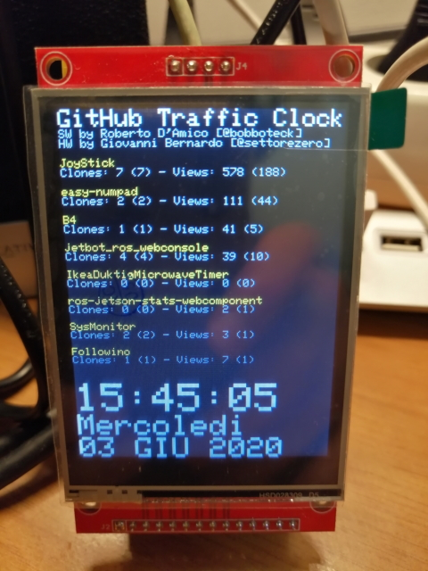
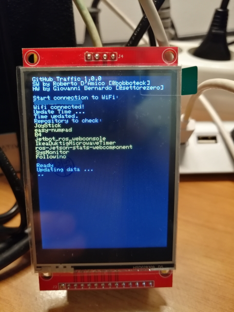

# GitHub Traffic Clock

[](LICENSE)

## About

**Author: [Roberto D'Amico](http://bobboteck.github.io)** - Based on original project by [Giovanni Bernardo](https://github.com/Cyb3rn0id/Coviclock).

Thi is a desk clock that not show only currente Time and Date, but every hour get data of traffic of your GitHub Repository. 
Github provides data from the last 14 days (2 weeks), this watch shows aggregate data regarding Clone number and Views.
**Clones** indicates the total clones, in brackets the number of unique users who made the clone.
**Views** indicates the number of pages to display, in brackets the number of unique viewers.



The traffic data are private information, to get them with the REST API you need a personal access token, at this [link](https://help.github.com/en/github/authenticating-to-github/creating-a-personal-access-token-for-the-command-line) you can find the istruction to generate it. Chose only the all repo check for this token autorizzation, after copy the token generated and past it in the GITHUB_TOKEN define string of mysettings.hpp file.
**Remember** that this string must be "token" + space + generated_token.

## mysettings.hpp
To use the code you need to create a file mysettings.hpp with the following code, or simply rename the mysettings.txt file and fill it with the correct values for your use.

```c++
#ifndef mysettings_H
#define mysettings_H

#define WIFI_SSID           "YOUR_WIFI_SSID_STRING"
#define WIFI_PWD            "TOUR_WIFI_PWD_STRING"
#define GITHUB_FINGER_PRINT "5974618813ca1234154d110ac17fe667076942f5"  // Scade il 16/07/2020
#define GITHUB_USERNAME     "YOUR_GITHUB_USERNAME"
#define GITHUB_TOKEN        "token ..."
#define REPOSITORY_NUMBER   8

// List of repository to be check
char* repositories[REPOSITORY_NUMBER] = { "JoyStick", "easy-numpad", "B4", "jetbot_ros_webconsole", "IkeaDuktigMicrowaveTimer", "ros-jetson-stats-webcomponent", "SysMonitor", "Followino" };

#endif
```

## Boot sequence

When you power on the circuit, a boot sequence of action was displayed.
First information about project and version installed.
After the connection status of WiFi network, the system Time update, the list of repositories from which to retrieve traffic data, and a dot for each REST API call (two for each repository).
After the screen show data and clock.



## New Feature

* Now show the temperature on the display
